## 1. The introduction about MetaCycle

### 1.1. General description about MetaCycle

The **MetaCycle** package is mainly used for detecting rhythmic signals from large scale time-series data. It incorporates [ARSER(ARS)](https://github.com/cauyrd/ARSER), [JTK_CYCLE(JTK)](http://openwetware.org/wiki/HughesLab:JTK_Cycle), and [Lomb-Scargle(LS)](http://research.stowers-institute.org/efg/2005/LombScargle/) properly for periodic signal detection, and could also output integrated analysis results if required. 

### 1.2. Types of time-series data

The usual time-series data is evenly sampled once at each time point, and the interval between neighbour time points is integer. Not all data are as simple as this. There are datasets with replicate samples, or with missing values, or un-evenly sampled, or sampled with a non-integer interval. Examples of these types of data are shown in the below table. 

Data Type                    | Point 1| Point 2| Point 3| Point 4| Point 5| Point 6
---------------------------  | -------| -------| -------| -------| -------| -------
The usual data               | CT0    | CT4    | CT8    | CT12   | CT16   | CT20  
With missing value           | CT0    | NA     | CT8    | CT12   | CT16   | CT20  
With replicates              | CT0    | CT0    | CT8    | CT8    | CT16   | CT16  
With un-even interval        | CT0    | CT2    | CT8    | CT10   | CT16   | CT20
With non-integer interval    | CT0    | CT4.5  | CT9    | CT13.5 | CT18   | CT22.5  

Of course, some datasets may seem combination of two or more of above types of data.

Data Type                           | Point 1| Point 2| Point 3| Point 4| Point 5| Point 6
------------------------------------| -------| -------| -------| -------| -------| -------
With replicates and missing value   | CT0    | CT0    | CT8    | NA     | CT16   | CT16  
With un-even interval and replicates| CT0    | CT2    | CT2    | CT10   | CT16   | CT20

### 1.3. Method selection

The **meta2d** function in **MetaCycle** is designed to analyze differnt types of time-series datasets, and it could automatically select proper method to analyze different types of input datasets. The implementation strategy used for **meta2d** is shown in the flow chart.

```{r, echo=FALSE, warning=FALSE, fig.width=6.65, fig.height=5}
library(shape)
library(diagram)
par(mar = c(1, 0.5, 1, 0.5))
openplotmat()
#number of elements in each row
num_element <- c(1, 1, 2, 3, 4, 5)
#get position information of each element in the flow chart
elpos <- coordinates (num_element, mx = 0)
#adjust x-position of some elements
elposM <- elpos
elposM[1:2, 1] <- elposM[1:2, 1] - 0.21
elposM[4,1] <- elposM[4,1] - 0.269
elposM[7,1] <- elposM[7,1] - 0.186
elposM[11,1] <- elposM[11,1] - 0.076
#give information of strat and end point of each arrow
fromto <- c( c(1, 2), c(2,12), c(2,4), c(4,13), c(4, 7),
             c(7, 14), c(7,11), c(11, 15), c(11, 16) )
fromtoM <- matrix(ncol = 2, byrow = TRUE, data = fromto)
rownum <- nrow(fromtoM)
#draw arrow and store arrow position informaion in 'arrposM'
arrposM <- matrix(ncol = 2, nrow = rownum)
for (i in 1:rownum)
{
    arrposM[i, ] <- bentarrow (from = elposM[fromtoM[i, 1], ], to = elposM[fromtoM[i, 2], ], 
                               lcol = "blue", lwd = 1, arr.pos = 0.56, arr.length = 0.3, arr.lwd = 0.8)
}
#draw elements of flow chart
textparallel(mid = elposM[1,], radx = 0.089, rady=0.06, lab = "Time-series\ndata", lcol = "blue", 
             lwd=2, shadow.size = 0, cex = 0.72, font=2, theta=80)
textdiamond(mid =  elposM[2,], radx = 0.12, rady=0.066, lab = "With\nnon-integer\nintervals?", 
            lcol = "blue", lwd=2, shadow.size = 0, cex = 0.72, font=2)
diamond_index <- c(4, 7, 11)
diamond_lab <- c("Uneven\nsampling?", "Missing\nvalue?", "With\nreplicates?")
for (i in 1:length(diamond_index))
{
  textdiamond(mid = elposM[diamond_index[i],], radx = 0.08, rady=0.066, lab = diamond_lab[i], 
              lcol = "blue", lwd=2, shadow.size = 0, cex = 0.72, font=2)  
}

round_index <- 12:16
round_lab <- c("LS", "LS", "JTK&LS", "JTK&LS", "ARS&\nJTK&LS")
for (j in 1:length(round_index))
{
    textround(mid = elposM[round_index[j],], radx=0.056, rady=0.05, lab = round_lab[j],
              lcol = "blue", lwd=2, shadow.size = 0, cex =0.76, font=2, rx = 0.02)
}
#add 'Y' and 'N' on the flow chart
midposM <- elposM[c(2, 4, 7, 11),]
xpos <- midposM[,1]
ypos <- midposM[,2]
YposM <- cbind(c( (xpos[1] - 0.145), (xpos[2:3] - 0.1), (xpos[4] - 0.086) ), ypos + 0.02)
NposM <- cbind(c( (xpos[1] + 0.145), (xpos[2:3] + 0.1), (xpos[4] + 0.086) ), ypos + 0.02)
text(YposM[,1], YposM[,2], labels="Y", cex=0.8, font=2)
text(NposM[,1], NposM[,2], labels="N", cex=0.8, font=2)
```

### 1.4. Integration strategies

In addition to selecting proper methods to analyze different kinds of datasets, **meta2d** could also output integrated results from multiple methods. Detail explaination about integration stragegies is in the [vignettes](https://cran.r-project.org/web/packages/MetaCycle/vignettes/implementation.html) of MetaCycle.

* ##### Pvalue

    + [Fisher's method](https://en.wikipedia.org/wiki/Fisher%27s_method) is implemented in **meta2d** for integrating multiple p-values. 

* ##### Period and phase

    + The integrated period is an arithmetic mean value of multiple periods, while phase integration based on [mean of circular quantities](https://en.wikipedia.org/wiki/Mean_of_circular_quantities) is implemented in **meta2d**.

*  ##### Amplitude calculation

    + **meta2d** recalculates the amplitude with following model:
$$Y_i = B + TRE*(t_i - \frac{\sum_{i=1}^n t_i}{n}) + A*cos(2*\pi*\frac{t_i - PHA}{PER})$$

    + B is baseline level of the time-series profile; TRE is trend level of the time-series profile; A is the amplitude of the waveform. PHA and PER are integrated period and phase mentioned above. 
    + The baseline and trend level are explained in the below example.

```{r, echo=FALSE, warning=FALSE, fig.width=6.65, fig.height=5}
library(MetaCycle)
getAMP <- function(expr, per, pha, tim=18:65)
{ 
    trendt <- tim - mean(tim[!is.na(tim) & !is.nan(tim)])
    cost <- cos(2*pi/per*(tim - pha))
    fit <- lm(expr~trendt + cost)
    fitcoef <- fit$coefficients
    basev <- fitcoef[1]
    trendv <- fitcoef[2]
    ampv <- fitcoef[3]
    fitexp <- basev + trendv*trendt + ampv*cost
    outL <- list("base"=basev, "trend"=trendv, "amp"=ampv, "fit"=fitexp)
    return(outL)
}

cirD <- cycVignettesAMP
ampL <- getAMP(expr=as.numeric(cirD[1,24:71]), per=cirD[1, "meta2d_period"], pha=cirD[1, "meta2d_phase"])

lay<-layout(cbind(1, 2), widths=c( lcm(cm(4.5)), lcm(cm(1.5)) ), heights=lcm(cm(4.5)) )
par(mai=c(0.65,0.6,0.4,0.05),mgp=c(2,0.5,0),tck=-0.01)
xrange <- c(18, 65)
yrange <- c(200, 2350)
plot(18:65, cirD[1,24:71], type="b", xlim=xrange, ylim=yrange, xlab="Circadian time(CT)", ylab="Expression value",  main=cirD[1,1], cex.main=1.2)
par(new=T)
plot(18:65, ampL[[4]], type="b", xlim=xrange, ylim=yrange, col="red", xlab="", ylab="", main="")
abline(h=ampL[[1]], lty=3, col="purple", lwd=1.5)
lines(18:65, 500+ampL[[2]]*(18:65-mean(18:65)), lty=4, col="orange", lwd=1.5)
legend("topleft", legend=c("Raw value", "OLS fitted value"), col=c("black", "red"), pch=1, bty="n")
legend("topright", legend=c("Baseline", "Trend"), col=c("purple", "orange"), lty=c(3, 4), lwd=1.5, bty="n" )

par(mai=c(0.5,0.05,0.4,0.1),mgp=c(2,0.3,0),tck=-0.01);
plot(x=NULL,y=NULL,xlim=c(0,10),ylim=c(0,10),type="n", xaxt="n",yaxt="n",bty="n",xlab="",ylab="",main="")
text(rep(1,3), c(8, 5, 2), c("Base = ", "Trend = ", "AMP = "), adj=0)
text_value <- unlist(ampL)
text(rep(6,6), c(8, 5, 2), round(text_value[1:3], 1), adj=0)
```

*  ##### About rAMP
    + **meta2d** outputs a relative amplitude value (rAMP), which normalizes amplitude values with expression levels. For example, *Ugt2b34* has a larger amplitude than *Arntl*, but its rAMP is smaller than *Arntl*.

```{r, echo=FALSE, warning=FALSE, fig.width=6.65, fig.height=5}
cirD <- cycVignettesAMP
cirM <- as.matrix(cirD[2:3, 24:71])
expmax <- apply(cirM, 1, max)
cirM <- cirM/expmax

lay<-layout(cbind(1, 2), widths=c( lcm(cm(4.5)), lcm(cm(1.5)) ), heights=lcm(cm(4.5)) )
par(mai=c(0.65,0.6,0.4,0.05),mgp=c(2,0.5,0),tck=-0.01)
xrange <- c(18, 65)
yrange <- c(0, 1)
colname <- c("red", "blue")
grey_trans <- rgb(191/255,191/255,191/255,0.65);

par(mai=c(0.65,0.6,0.2,0.05),mgp=c(2,0.5,0),tck=-0.01)
plot(NULL,NULL,xlim=xrange,ylim=yrange,xaxt="n",yaxt="n",xlab="Circadian time(CT)",ylab="Exp/Max", main="");
rect_xL <- c(18, 36, 60)
rect_yL <- c(24, 48, 65)
rect(rect_xL, rep(-0.1, 3), rect_yL, rep(1.1,3), col=grey_trans, border=NA, bty="n")

for (i in 1:2)
{
  loessD <- data.frame(expd=as.numeric(cirM[i,]),tp=18:65);
  exploess <- loess(expd~tp, loessD, span = 0.2);
  expsmooth <- predict(exploess, data.frame(tp=18:65));
  lines(18:65,expsmooth,lwd=1.2,col=colname[i]);
}

xpos <- c(seq(18,60,by=6), 65)
axis(side=1,at=xpos,labels=xpos,mgp=c(0,0.2,0),tck=-0.01,cex.axis=0.8)
ypos <- seq(0, 1, by=0.2)
axis(side=2,at=ypos,labels=ypos,mgp=c(0,0.2,0),tck=-0.01,cex.axis=0.8)

par(mai=c(0.5,0.05,0.2,0.1),mgp=c(2,0.3,0),tck=-0.01)
plot(x=NULL,y=NULL,xlim=c(0,10),ylim=c(0,10),type="n", xaxt="n",yaxt="n",bty="n",xlab="",ylab="",main="")
lines(c(0.2,2.3), c(9.5,9.5), col="blue", lwd=1.5)
text(c(5,0,0), c(9.5, 8, 6.5), c("Ugt2b34", "AMP = ", "rAMP = "), col="blue", adj=0)
text(c(5,5), c(8, 6.5), round(as.numeric(cirD[3, 22:23]), 2), col="blue", adj=0)

lines(c(0.2,2.3), c(4.5,4.5), col="red", lwd=1.5)
text(c(5,0,0), c(4.5, 3, 1.5), c("Arntl", "AMP = ", "rAMP = "), col="red", adj=0)
text(c(5,5), c(3,1.5), round(as.numeric(cirD[2, 22:23]), 2), col="red", adj=0)
```

### 1.5. Description about output values

Column name    | Description               |  Column name    | Description 
-------------  | -----------------------   |  ---------------| --------------   
ARS_pvalue     | pvalue from ARS           |  LS_BH.Q        | FDR from LS    
ARS_BH.Q       | FDR from ARS              |  LS_period      | period from LS
ARS_period     | period from ARS           |  LS_adjphase    | adjusted phase from LS
ARS_adjphase   | adjusted phase from ARS   |  LS_amplitude   | amplitude from LS
ARS_amplitude  | amplitude from ARS        |  meta2d_pvalue  | integrated pvalue
JTK_pvalue     | pvalue from JTK           |  meta2d_BH.Q    | FDR based on integrated pvalue
JTK_BH.Q       | FDR from JTK              |  meta2d_period  | averaged period     
JTK_period     | period from JTK           |  meta2d_phase   | integrated phase 
JTK_adjphase   | adjusted phase from JTK   |  meta2d_Base    | baseline value given by meta2d 
JTK_amplitude  | amplitude from JTK        |  meta2d_AMP     | amplitude given by meta2d 
LS_pvalue      | pvalue from LS            |  meta2d_rAMP    | relative amplitude

## 2. Take a quick check about installed software and packages

* #### Before this demo, please make sure that you have read the [README](https://github.com/gangwug/SRBR_SMTSAworkshop) page for this workshop. 

* #### Please open the 'demo.html' file in 'demo' directory of SRBR_SMTSAworkshop. You could copy and paste associated codes into RStudio, and do not need to type them line by line.

* #### Check the installed RStudio and packages
    + ##### Click the RStudio icon to open it. The RStudio window will show as below (If the Console part(left bottom) does not shows 'R version 3.3.0', plese follow [README](https://github.com/gangwug/SRBR_SMTSAworkshop) file for installing the latest R version or switch to the latest R version):
    
    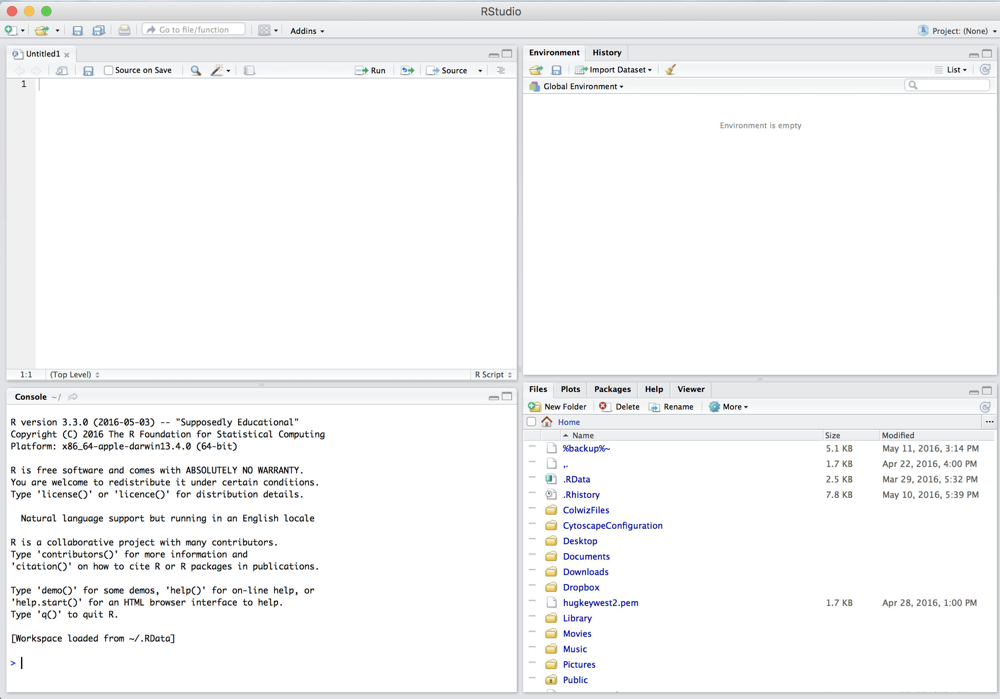
    
    + ##### Type below command in the Console part to check installed packages
    
```{r, eval=FALSE, warning=FALSE}
# load 'shiny' package
library("shiny")
# load 'MetaCycle' package
library("MetaCycle")
# load 'dplyr' package
library("dplyr")
# load 'ggplot2' package
library("ggplot2")
# load 'cowplot' package
library("cowplot")
```

* #### Check downloaded repositories

    + ##### Type below command to check whether "MetaCycleApp-master", "PSEA-master" and "SRBR_SMTSAworkshop-master" directories are on the desktop of laptop

```{r, eval=FALSE, warning=FALSE}
# change working directory to the desktop 
setwd("~/Desktop")

# check required directories under the desktop
dir()
```

* #### If all required packages are successfully installed and three requied directories has been downloaded to the desktop of labtop, it would show below records in the Console part:
    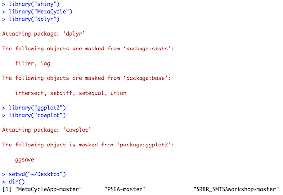


## 3. The demo pipeline about MetaCycle

### 3.1. Open the web application of **meta2d**

* ##### Option 1: use 'runGitHub' function by typing below command in the 'Console' window of RStudio (this option requires that the laptop is connected with internet)

```{r, eval=FALSE, warning=FALSE}
# load shiny package
library("shiny")

# use 'runGitHub' function of shiny package
runGitHub("MetaCycleApp", "gangwug")
```

* ##### Option 2: use 'runApp' function by typing below command in the 'Console' window of RStudio (this option does not require that the laptop is connected with internet)

```{r, eval=FALSE, warning=FALSE}
# load shiny package
library("shiny")

# use 'runApp' function of shiny package
runApp("~/Desktop/MetaCycleApp-master")
```

* ##### IMPORTANT NOTE: for windows system users, it is required to click 'Open in Browser' button for downloading the analysis outputs to local computer. 

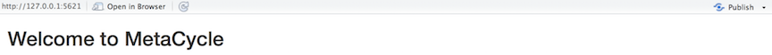

* ##### To terminate the web application, just turn off the web application page or click red 'stop' button on top right of 'Console' window of RStudio.

* ##### If the web application is successfully opened, it will show a window like below:
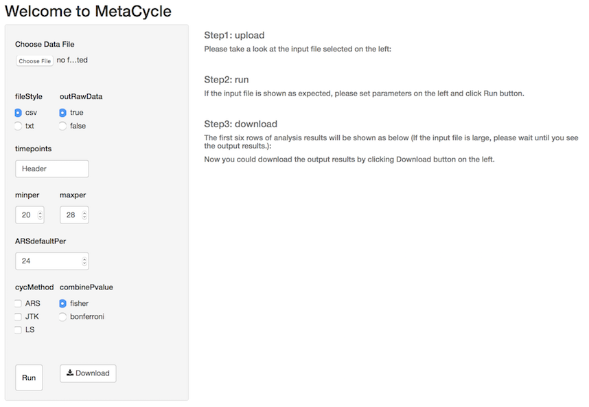

### 3.2. Analyze three cases with the web application of meta2d

* #### caseA (csv): 1) evenly sampled with 4h interval covering two days (from CT18 to CT62), 2) no replicate or missing value
    + ##### goal: use JTK_CYCLE to detect circadian transcripts with MetaCycleApp
    + ##### step 1: click 'Choose File' button to upload caseA dataset from 'data' directory
    
    + ##### step 2: set the parameters as shown below (set 'minper' and 'maxper' to 24 and select 'JTK' from 'cycMethod') and click 'Run' button
    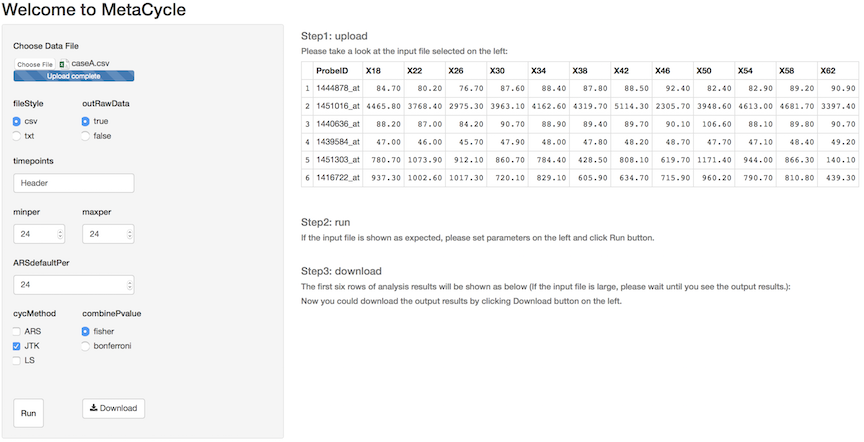
    + ##### step 3: take a quick check of the analysis results
    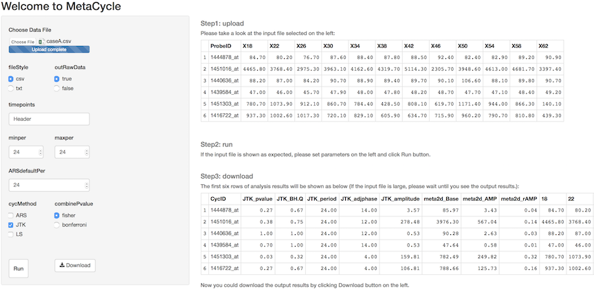
    + ##### step 4: click 'download' button at bottom to download the outputs to 'result' directory and name the output file as 'meta2d_caseA.csv'
    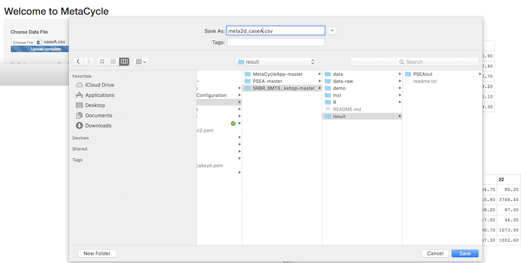

* #### caseB (txt): 1) evenly sampled with 6h interval covering two days (from CT20 to CT62), 2) no replicate 3) one missing time point at CT50
    + ##### goal: use JTK_CYCLE and Lomb-Scargle to detect circadian transcripts with MetaCycleApp
    + ##### detail steps: 1) follow caseA to upload caseB dataset from 'data' directory, 2) parameters setting: select 'txt' under fileStyle, paste comma-delimited time values under 'timepoints', set 'minper' and 'maxper' to 24, and select 'JTK' and 'LS' under 'cycMethod', 3) click 'Run' button, 4) click 'Download' button to save outputs (named as 'meta2d_caseB.txt') to 'result' directory, 5) you could see a window like below during analyzing caseB dataset
    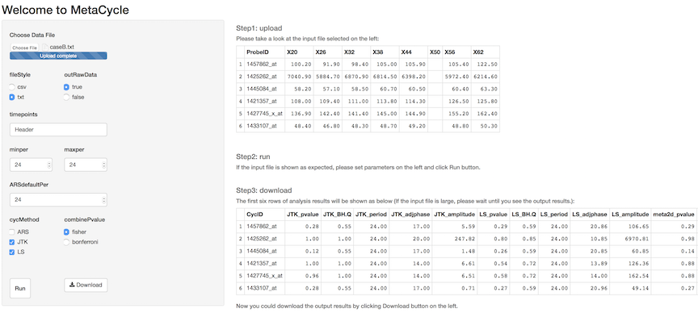
    
* #### caseC (csv): 1) cell cycle data from yeast, 2) evenly sampled with 16min interval from 2min to 162min, 3) no replicate or missing value, 4) the expected time length for cell cycle of this kind of yeast is 85min
    + ##### goal: use ARSER, JTK_CYCLE and Lomb-Scargle to detect cycling transcripts from yeast cell cycle dataset
    + ##### detail steps: 1) follow above cases to upload caseC dataset from 'data' directory, 2) parameters setting: select 'csv' under fileStyle, type 'Header' under 'timepoints', set 'minper' as 80 and 'maxper' as 96, set 'ARSdefaultPer' as 85, and select all three methods under 'cycMethod', 3) click 'Run' button, 4) click 'Download' button to save outputs (named as 'meta2d_caseC.csv') to 'result' directory, 5) you could see a window like below during analyzing caseC dataset
    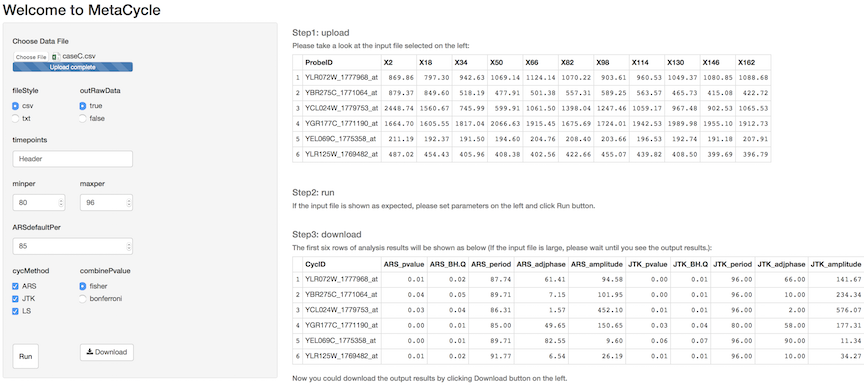

### 3.3. Please analyze five exercise datasets (file names containing 'exercise' in 'data' directory) with MetaCycleApp according to instructions mentioned above

* ##### exerciseA (txt): 1) evenly sampled with 4h interval covering one day (from CT19 to CT39), 2) no replicate or missing value

* ##### exerciseB (csv): 1) evenly sampled with 4h interval covering two days, 2) three replicates at each time point, 3) no missing value

* ##### exerciseC (csv): 1) evenly sampled with 4h interval covering two days, 2) varied number of replicates at each time point, 3) no missing value

* ##### exerciseD (csv): 1) evenly sampled with 3h interval covering two days (from CT0 to CT45), 2) three replicates at each time point 3) there is random missing value in some rows

* ##### exerciseE (csv): 1) un-evenly sampled from CT19 to CT57, 2) no replicates or missing value

* ##### general advice: 1) try exerciseA and exerciseB within this workshop and do the remaining after this workshop, 2) select all three methods under 'cycMethod' and MetaCycleApp will automaticlly select methods that could be used to analyze input dataset, 3) to search circadian profiles, it is better to set both 'minper' and 'maxper' as 24, 4) select 'csv' or 'txt' under 'fileStyle' according to input file

### 3.4. Analyze the experimental data (it may take several minutes)

* ##### experimentA:  1) evenly sampled with 2h interval covering two days (from CT18 to CT64), 2) no replicate or missing value, 3) sampling time information is numeric value in the header, 4) including 15K probesets (about 1/3 of total probesets for MOE4302 array)

* ##### general advice: 1) select 'JTK' and 'LS' in analyzing high-resolution datasets (eg. 2h / 2days, 'ARS' shows relative higher false positive rates in analyzing these kinds of datasets), 2) set 'minper' and 'maxper' both as '24' for searching circadian transcripts, 3) save outputs in 'result' directory and name it as 'meta2d_experimentA.csv', 4) if following above advice, you could see a window like below during analyzing this dataset

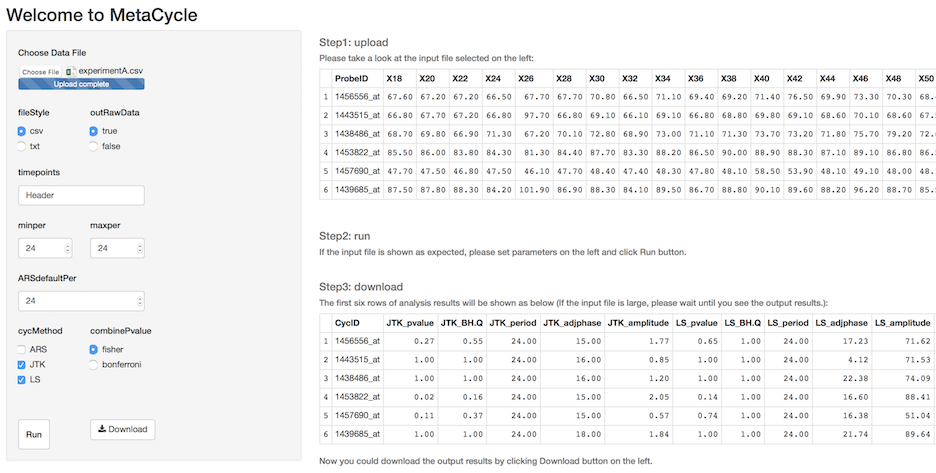

### 3.5. Check the expression profiles of circadian transcripts (FDR < 0.05) and show their phase distribution

* #### Type below command in the 'Console' window of RStudio to prepare the dataframe ('figureD') used for drawing figures

```{r, warning=FALSE, message=FALSE}
# load dplyr package
library("dplyr")

# read in the 'meta2d_experientA.csv' file
dataD <- read.csv("~/Desktop/SRBR_SMTSAworkshop-master/result/meta2d_experimentA.csv", stringsAsFactors = FALSE)
# take a look at column names of the data
colnames(dataD)

# filter the data by meta2d_BH.Q < 0.05 by 'filter' function of dplyr
cirD <- filter(dataD, meta2d_BH.Q < 0.05)
# see the number of circadian transcripts
nrow(cirD)

# select "CycID", "meta2d_period", "meta2d_phase", and "X18" to "X64" columns for drawing heatmap by 'select' function of dplyr package
figureD <- select(cirD, CycID, meta2d_period, meta2d_phase, num_range("X", seq(18, 64, by=2), width = 2))
```

* #### Type below command in the 'Console' window of RStudio to draw a heatmap figure of circadian transcripts (if the code runs well, a heatmap figure will show in the bottom right window of the RStudio)

```{r, warning=FALSE, message=FALSE}
# load 'heatmapF' and 'phaseHist' function used to draw heatmap and histogram
source("~/Desktop/SRBR_SMTSAworkshop-master/R/fig.R")

# get the heatmap figure by 'heatmapF' function
heatmapFigure <- heatmapF(inputD = figureD, minfold=0.5, maxfold=2)

heatmapFigure
```

* #### Type below command in the 'Console' window of RStudio to draw a histgram for phase distribution of circadian transcripts selected above (if the code runs well, a histogram figure will show in the bottom right window of the RStudio)

```{r, warning=FALSE, message=FALSE}
# get the phase distribtuion figure by 'phaseHist' function
histFigure <- phaseHist(inputD = figureD, binvalue=seq(0,24,by=2), histcol = "blue")

histFigure
```

## 4. The demo pipeline about PSEA

#### Phase Set Enrichment Analysis (PSEA) is designed to incorporate prior knowledge into the analysis of periodic data. PSEA could identify biologically related gene sets showing temporally coordinated expression. For more detail introduction about PSEA, please see Ray's [PSEA paper](http://jbr.sagepub.com/content/31/3/244.long). 

* #### Try to open a 'jar' file

    + ##### Go to "PSEA-master" directory, and could see 'PSEA1.1_VectorGraphics.jar'
    + ##### Right click this file and click 'open'. On mac computer, it may show below dialog, and just click 'Open'.
    
    
    + ##### If these this 'jar' file is successfully opened, you could see below dialog (If not, please follow [README](https://github.com/gangwug/SRBR_SMTSAworkshop) file to install latest Java).
    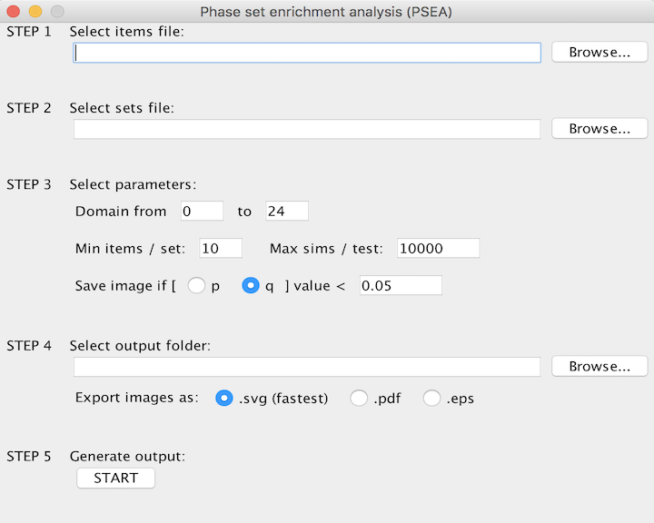
    
### 4.1. Prepare the file used for PSEA analysis

* #### Type below command in the 'Console' window of RStudio to prepare the file used to PSEA analysis

```{r, warning=FALSE, message=FALSE}
# take a look at column names of 'cirD' dataframe
colnames(cirD)
# if it reports error after typing above command, please re-run the code of preparing 'figureD' in the first part of 3.5 section of this demo

# select its 'CycID', "meta2d_BH.Q", 'meta2d_phase' columns for later analysis
phaseD <- select(cirD, CycID, meta2d_BH.Q, meta2d_phase)

# read in the annotation file-'annoDbiMainInfMouse4302.txt' in the 'data-raw' directory
annoD <- read.delim("~/Desktop/SRBR_SMTSAworkshop-master/data-raw/Mouse4302ProbeAnnotation.txt", stringsAsFactors = FALSE)

# add annotation information with 'inner_join' function of dplyr package
phaseD <- inner_join(phaseD, annoD, by=c("CycID" = "PROBEID"))
# take a look at the phaseD
head(phaseD)
# filter out those probesets without annotation information
phaseD <- filter(phaseD, SYMBOL != "NA")

# select 'SYMBOL', 'meta2d_BH.Q' and 'meta2d_phase' columns for getting a dataframe without duplicate gene names
ori_phaseD <- select(phaseD, SYMBOL, meta2d_BH.Q, meta2d_phase)
# take a look at the row number with possilbe duplicate gene names
dim(ori_phaseD)
# load the 'uniF' function from 'fig.R' for doing this work
source("~/Desktop/SRBR_SMTSAworkshop-master/R/fig.R")
# get a dataframe without duplicate gene names
uni_phaseD <- uniF(ori_phaseD)
# take a look at the rownumber now
dim(uni_phaseD)

# select 'SYMBOL' and 'meta2d_phase' columns for PSEA analysis
pseaD <- select(uni_phaseD, SYMBOL, meta2d_phase)
# take a look at the pseaD
head(pseaD)

# write the 'pseaD' dataframe to a txt file-'experimentPSEA.txt' in 'result' directory
write.table(pseaD, file = "~/Desktop/SRBR_SMTSAworkshop-master/result/experimentPSEA.txt", sep = "\t", quote = FALSE, row.names = FALSE)
```

* #### Check the 'result' directory and make sure there is a file named 'experimentPSEA.txt'

### 4.2. Convert the mouse gene name to its human homolog gene name

* #### Type below command in the 'Console' window of RStudio to convert the mouse gene name to its human homolog gene name

```{r, warning=FALSE, message=FALSE}
# read in the 'experimentPSEA.txt' file
ori_pseaD <- read.delim("~/Desktop/SRBR_SMTSAworkshop-master/result/experimentPSEA.txt", stringsAsFactors = FALSE)
# take a look at the data
head(ori_pseaD)

# read in the 'MouseHumanHomolog.txt' file in 'data-raw' directory of SRBR_SMTSAworkshop-master
homoD <- read.delim("~/Desktop/SRBR_SMTSAworkshop-master/data-raw/MouseHumanHomolog.txt", stringsAsFactors = FALSE)
# take a look at the data
head(homoD)

# join mouse gene and human homolog gene with 'inner_join' function
homo_pseaD <- inner_join(ori_pseaD, homoD, by=c("SYMBOL" = "Mouse_gene"))
# take a look at the joined dataframe
head(homo_pseaD)

# select "Human_gene" and "meta2d_phase" columns for PSEA analysis
outD <- select(homo_pseaD, Human_gene, meta2d_phase)
# take a look at the selected data
head(outD)
# write it to a file named-'human_experimentPSEA.txt' in 'result' directory of SRBR_SMTSAworkshop-master
write.table(outD, file = "~/Desktop/SRBR_SMTSAworkshop-master/result/human_experimentPSEA.txt", sep = "\t", quote = FALSE, row.names = FALSE, col.names = FALSE)
```

* #### Go to 'result' directory of SRBR_SMTSAworkshop-master and you will find the output file named as 'human_experimentPSEA.txt'. 

### 4.3. Do PSEA analysis with 'PSEA1.1_VectorGraphics.jar'

* #### Go to 'PSEA-master' directory and open 'PSEA1.1_VectorGraphics.jar'
* #### Click 'Browse' button under 'STEP 1 Select items file:' to upload the input file ('human_experimentPSEA.txt' in 'result' directory of 'SRBR_SMTSAworkshop-master') as shown below

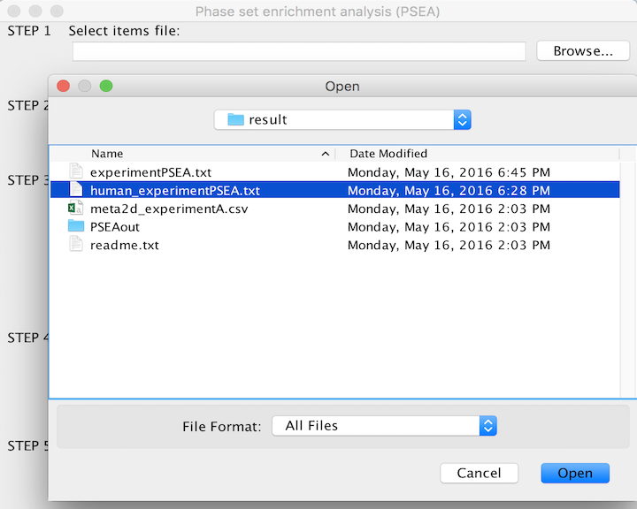

* #### Click 'Browse' button under 'STEP 2 Select sets file:' to select the biologically related gene sets file (select 'c2.all.v5.1.symbols.gmt' file in 'data-raw' directory) as shown below

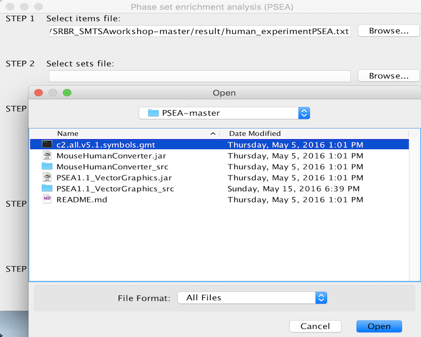

* #### Set corresponding parameters under 'STEP 3 Select parameters:' according to the sepecific study (here we use default values, except set q value < 0.1) as shown below

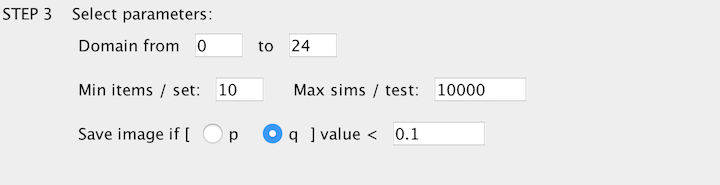

* #### Click 'Browse' button under 'STEP 4 Select output folder:' to select the directory used to store output files (select 'PSEAout' directory within 'result' directory of 'SRBR_SMTSAworkshop-master') as shown below

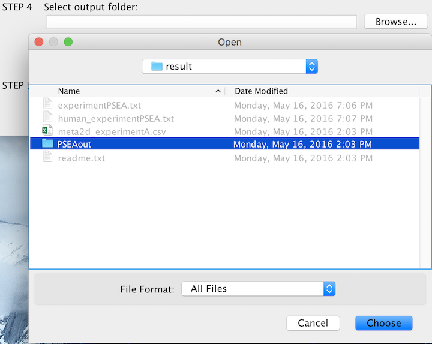

* #### Click 'START' button under 'STEP 5 Generate output:' to generate output files and 'START' button will change to 'DONE' button as shown below

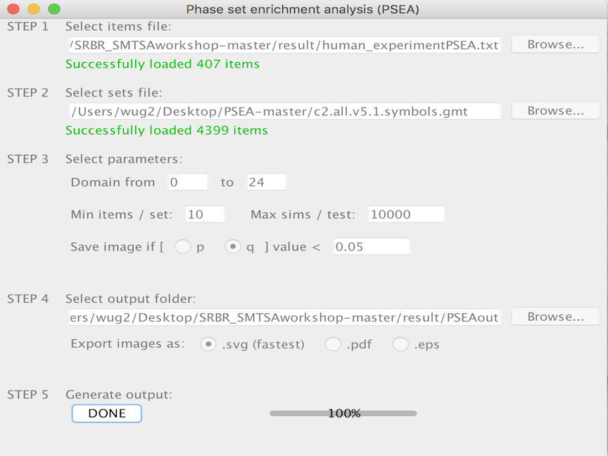

* #### Go to 'PSEAout' directory in 'result' directory and you will find three output files ('vsUniform.svg', 'vsBackground.svg' and 'results.txt') and two output directories ('vsUniform' and 'vsBackground'). Open 'vsUniform.svg', you will see all phase enriched itmes with significant q value, look like below

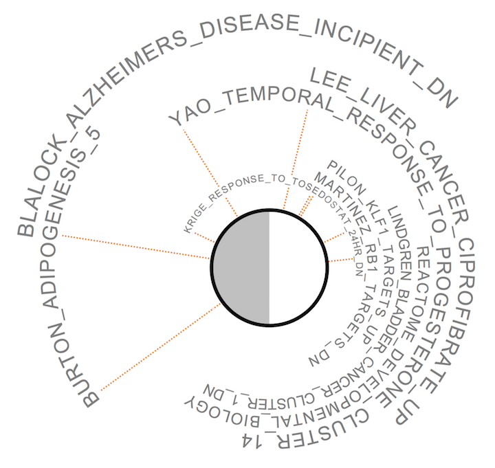

* #### Go to 'vsUniform' directory within 'PSEAout' directory and you will find gene list corresponding to each enriched item shown on the 'vsUniform.svg'. There are also figures showing the phase distribution of listed genes for each enriched item, look like below

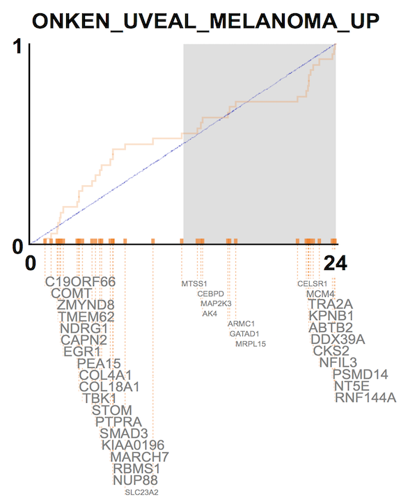

## 5. Try your data or share your experience of analyzing time-series data


